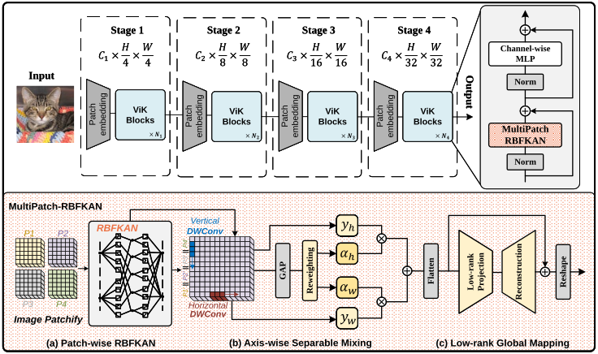

# Vision KAN (ViK)

This repository provides the official PyTorch implementation of  
**Vision KAN: Towards an Attention-Free Backbone for Vision with Kolmogorov-Arnold Networks**.

> An attention-free KAN-based vision backbone that replaces self-attention blocks with improved Kolmogorov-Arnold Networks.

<p align="center">
  
</p>

<p align="center">
  <em>Overview of Vision KAN (ViK).</em>
</p>

## ImageNet-1K Classification Performance

| Model                | Type       | Params (M) | GFLOPs | Top-1 Acc (%) |
|----------------------|------------|------------|--------|---------------|
| ResNet-18            | CNN        | 11.7       | 1.8    | 70.6          |
| ViT-Ti/16            | Attention  | 5.7        | 1.3    | 72.7          |
| DeiT-Tiny            | Attention  | 5.7        | 1.3    | 72.2          |
| PVT-Tiny             | Attention  | 13.2       | 1.9    | 75.1          |
| ResMLP-S12           | MLP        | 15.0       | 3.0    | 76.6          |
| **ViK-Small (ours)** | **KAN**    | **13.5**   | **1.6**| **76.5**      |


## Requirements

### Environment
We recommend using **Conda** to manage the environment.

All dependencies are provided in `environment.yml`. You can create the environment with:

```bash
conda env create -f environment.yml
```
After installation, activate the environment:

```bash
conda activate vik
```
### Data preparation
We follow the standard ImageNet-1K directory structure used by most PyTorch vision repositories.

Please organize the dataset as follows:
```bash
imagenet/
├── train/
│   ├── n01440764/
│   │   ├── n01440764_10026.JPEG
│   │   ├── n01440764_10027.JPEG
│   │   └── ...
│   ├── n01443537/
│   └── ...
└── val/
    ├── n01440764/
    │   ├── ILSVRC2012_val_00000293.JPEG
    │   └── ...
    ├── n01443537/
    └── ...
```


## Model Training

You can train ViK models on ImageNet-1K using distributed data parallel (DDP) with `torchrun`.

Below is an example command to train **ViK-Small** on ImageNet-1K using **4 GPUs**:

```bash
torchrun --nproc_per_node=4 train.py \
  /path/to/imagenet \
  --model vik_small \
  -b 256 \
  --lr 1e-3 \
  --drop-path 0.1 \
  --amp
```

This example was run on 4× NVIDIA RTX A6000 GPUs. You can adjust the batch size, learning rate, or model variant according to your hardware and training setup.

## Validation

To evaluate the trained model on ImageNet validation set, run the following command:

```bash
python validate.py /path/to/imagenet \
  --model vik_small \
  -b 256 \
  --checkpoint /path/to/your_checkpoint.pth.tar \
  --amp
```

## Updates

- [ ] Release pretrained ViK checkpoints.
- [ ] Evaluate ViK on object detection and semantic segmentation benchmarks.
- [ ] Investigate deeper ViK architectures with larger depth and capacity.

## Acknowledgements

We would like to thank the authors of the original implementations of Kolmogorov–Arnold Networks and RBF-based KANs, which inspired and facilitated this work:

- [pyKAN](https://github.com/KindXiaoming/pykan) 
- [RBFKAN](https://github.com/Sid2690/RBF-KAN) 

Their open-source contributions provided valuable references for understanding and implementing KAN-based models.

We also acknowledge the [pytorch-image-models](https://github.com/huggingface/pytorch-image-models) for providing a widely adopted and well-engineered training framework for vision models.


## Citation
If you find this work useful, please cite it as:

